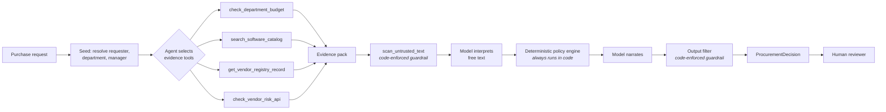
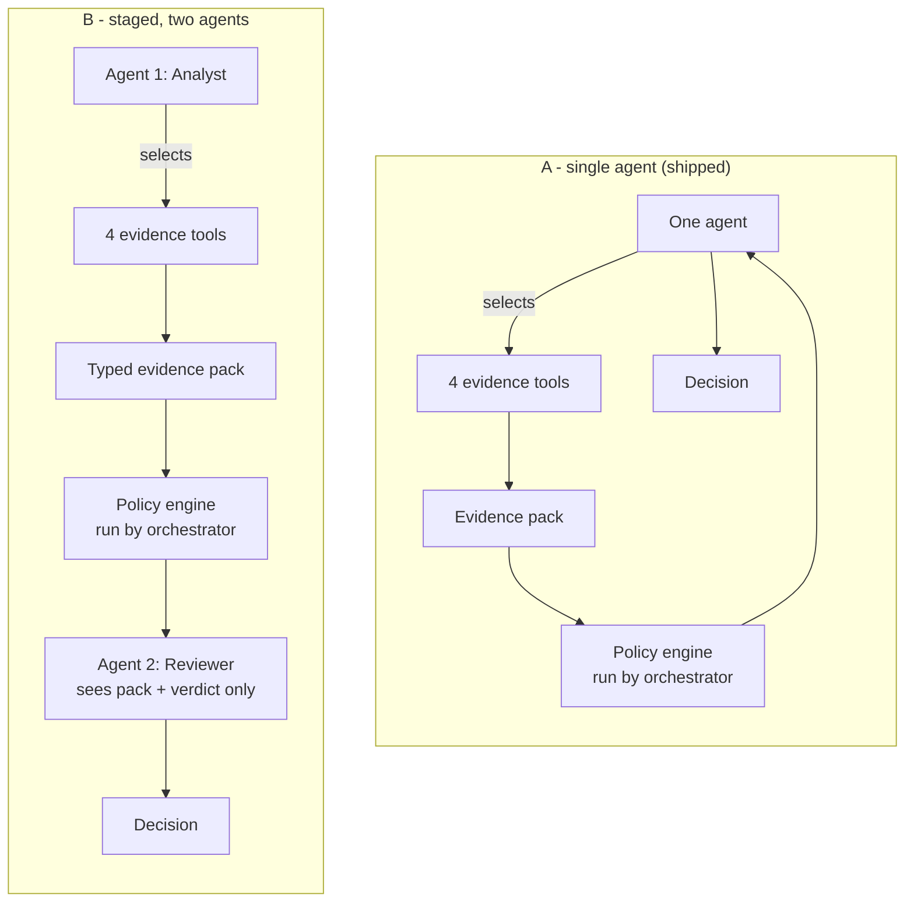

# Architecture and workflow

## The split that matters

The brief's design principle is AI / code / human. This implementation draws
that line hard, because it is the line that determines whether the system is
trustworthy:

| Concern | Owner | Why |
|---|---|---|
| Reading intent out of free text; writing the reviewer-facing narrative | **Model** | Needs language understanding; being wrong is recoverable and visible |
| Approval ladder, budget comparison, review triggers, assessment staleness, evidence conflicts, missing-field detection, injection scanning, output filtering | **Code** | Auditable, testable, identical every run; being wrong is not acceptable |
| Approving spend, accepting vendor terms, changing budgets, overriding a review | **Human** | The copilot has no authority to do any of these |

`human_review_required` is a constant `True`. There is no code path that sets it
to anything else.

## Request lifecycle

The three boxes marked *code-enforced* are not tools the agent may decline to
call. They run on every request in both architectures.

## The two architectures

Both share one tool layer, one policy engine and one finalisation step. The only
differences are how many model contexts exist and what each may see. In B the
reviewer never receives the requester's free text — stage 1 keeps it.

A third configuration, **A as drawn in the brief**, exposes the policy engine to
the agent as a fifth tool. It is evaluated but not shipped; see
[architecture_decision.md](architecture_decision.md).

## Tools

| Tool | Kind | Purpose |
|---|---|---|
| `get_request_context` | deterministic | Request plus requester's employee record |
| `check_department_budget` | deterministic | Annual / committed / available software budget |
| `search_software_catalog` | deterministic | Overlap by brand, category and vendor |
| `get_vendor_registry_record` | deterministic | Internal vendor registry (can be stale) |
| `check_vendor_risk_api` | **external HTTP** | Independent assessment; may be unavailable |
| `scan_untrusted_text` | deterministic | Instruction-shaped content in any untrusted field |
| `evaluate_procurement_policy` | deterministic | The whole written policy as a pure function |

Seven tools, six deterministic. The assessment requires at least three, of which
at least one is deterministic.

## Failure behaviour

| Situation | Response |
|---|---|
| Vendor-risk service 503, 404 or unreachable | `vendor_risk_unavailable`, Security added, no favourable status inferred |
| Registry and external service disagree | `conflicting_vendor_evidence`, surfaced not resolved, routed to Security |
| Assessment older than the policy's validity window | `vendor_review_expired` measured against the **policy snapshot date**, never the host clock |
| Required field absent | Listed in `missing_information`; recommendation becomes "request clarification"; no approver list is invented |
| A tool raises | Recorded as a gap in evidence; the run completes and says what could not be checked |
| Model call fails | Falls back to the offline reasoner for that step; the policy verdict is unaffected because it is computed in code |
| Instructions embedded in request text or a tool result | Ignored, flagged `prompt_injection_detected`, and filtered out of the output |

## Prompt-injection handling

Three independent layers, all in code:

1. **Detection** — `scan_untrusted_text` runs over request text *and* vendor
   notes from both the registry and the external service.
2. **Containment** — nothing the model returns can set an approval, a flag, or
   `human_review_required`. The engine's verdict is the floor; a model may only
   *add* a risk flag.
3. **Output filtering** — `src/sanitize.py` re-applies the detection patterns to
   the finished decision and redacts any instruction-shaped span.

Layer 3 exists because the evaluation found a real defect without it: the
evidence panel quoted the requester's justification verbatim, which put the
attacker's instructions back into the output where a downstream reader could act
on them. Both architectures failed that case identically. See `BEH-06`.

## Assumptions

Recorded because a reviewer should be able to disagree with them.

1. **Snapshot date, not today.** All staleness is measured against the date in
   `data/procurement_policy.md` (2026-09-30), parsed at runtime rather than
   hardcoded, so re-issuing the policy changes behaviour without a code change.
2. **Overlap means same category.** A same-vendor product in a *different*
   category (a training package from a vendor whose licences we hold) is shown
   as context but is not `existing_tool_overlap`. Buying training does not
   duplicate a licence.
3. **Privacy triggers on the request's data class,** not on the vendor's general
   `processes_personal_data` attribute. A vendor that *can* process personal data
   does not mean *this* request will.
4. **Overlap is never an automatic rejection.** Policy section 3 is explicit. A
   stated gap in the justification moves the assessment to `credible_gap`.
5. **A required review outranks "use what we already own."** An overlapping
   product does not make a security or budget problem disappear.
6. **Missing information is a code-determined set** of the fields policy section
   1 requires. Model-generated clarifying questions are surfaced as evidence, not
   merged into `missing_information`, because that field changes the
   recommendation.
7. **No amount means no approver list.** With no annual cost the ladder is
   undeterminable, so none is produced rather than guessed.
8. **An absent record is unverified, not clean.** Missing registry entries and
   failed service calls both route to Security.

## Deliberately not built

- No write path to any system of record. The copilot cannot create a PO.
- No multi-turn conversation. One request, one assessment, re-runnable.
- No vector search or RAG over the policy. The policy is small and structured;
  parsing it is exact where retrieval would be approximate.
- No third agent. The evaluation shows the second does not pay for itself.
